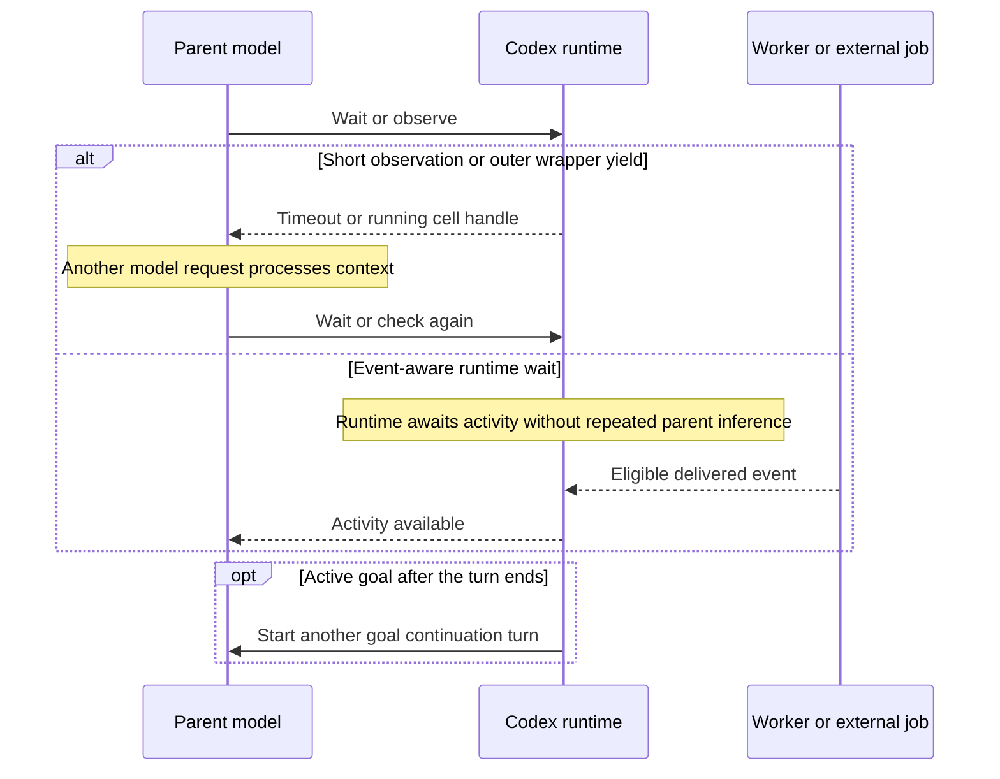

# Independent validation of Codex Astra/Sol waiting overhead

**Date:** September 14, 2026  
**Tested binary:** Codex CLI `0.154.0`, macOS; this investigation's live model was `gpt-6-astra`, reasoning `xhigh`.  
**Purpose:** Establish what can be recommended before producing company-wide guidance. The proposed addition is exported separately; following the user's export request, the current revision is also written to this workspace's active `$CODEX_HOME/AGENTS.md`.

## TL;DR

**Subsequent live measurements:** the [runtime/prompt benchmark](CODEX_WAITING_RUNTIME_PROMPT_BENCHMARK.md) adds actual parent/child workloads, release comparisons, separated token categories, and API-rate dollar equivalents. Its findings supersede the earlier pilot-readiness assessment below. The rest of this document retains the earlier investigation and its historical limitations.

**Waiting overhead is reproducible on Codex CLI `0.154.0`.** Live Astra probes and 14 passing scripted runtime tests confirm that short observations, outer-wrapper yields, and active-goal continuations can repeatedly invoke the model without useful new information. This is repeated inference at waiting boundaries, not continuous token generation during a suspended wait.

- **Subagents:** Prefer direct `collaboration.wait_agent` with a timeout that leaves time for required progress updates. Five-minute waits work at runtime, but prescribing them unconditionally conflicts with the current 60-second commentary instruction. Input interruptibility does not resolve that conflict.
- **Shell commands:** Retain the session handle and coordinate the inner completion wait with the outer `functions.exec` yield. Extending only one layer may leave repeated model resumptions.
- **External dependencies and goals:** Native sleep does not guarantee wakeup on job completion. For prolonged external waits under `/goal`, use `/goal pause`, verify `paused`, and resume when action is possible. A “waiting” reply does not pause the goal.
- **Arguments:** Use integer millisecond literals. Even `1.0` is rejected by the tested integer parsers.
- **Prompt caching:** The current export omits the earlier 25-minute checkpoint. Cache-only keepalives have no measured savings here, and the API cache policy is not an independently verified subscription guarantee. Longer waits can still change cache costs.
- **Rollout:** The subsequent 73-workload [benchmark](CODEX_WAITING_RUNTIME_PROMPT_BENCHMARK.md) found substantial Astra benefits after tuning but no universal Sol savings. Six v3 trials met the recorded update cadence; two v4 CI trials validated explicit watcher limits/backoff. V4's unchanged command/subagent rules were tested under v3, not rerun as a complete v4 suite. The current [export](../guides/AGENTS.waiting-compatible.md) is a compact rewrite of v4 tested in three additional clean Astra workloads: it reduced usage and API-rate equivalents but increased CI result delay. It remains a targeted pilot rather than a company-wide savings promise; the compact version has not been tested on Sol.

## Assessment

**The repeated-inference mechanism is real and reproducible on the installed runtime. It is a family of waiting and continuation behaviors, not an established Astra-specific defect or a measured explanation of the company's usage increase.** The supplied [handoff](../archive/investigation/CODEX_ASTRA_SOL_WAITING_INVESTIGATION.md) is substantially sound about that distinction. Its strongest hypotheses now have runtime evidence, but model-selection causality and company savings remain unresolved.

The smallest defensible mitigation is to **reduce unnecessary returns to the model while retaining a reliable way to receive the result**. Which mechanism accomplishes this depends on what is pending:

| Pending work | Smallest useful intervention | Evidence and limit |
|---|---|---|
| V2 subagent work | Use direct event-aware `collaboration.wait_agent` with an explicit timeout that leaves time for required updates. Prefer multi-minute waits only where the effective instructions allow them. | Long timeouts are accepted and delivered steering interrupts them. Earlier five-minute prompt trials demonstrated tool selection, but did not satisfy the one-minute commentary cadence. |
| An existing shell command | Retain its session handle; use a completion-aware `write_stdin` wait and make the outer code-mode yield long enough to cover that observation. | There are two timeout layers. Changing only the inner wait leaves the outer resumption boundary. |
| External state without a callback | Make one authoritative check at a useful interval; use native integer-valued sleep between necessary checks. | Sleep itself does not subscribe to shell exit, CI, or a review decision. Detection can be delayed until the next check. |
| Prolonged external waiting under `/goal` | User pauses the goal, verifies `paused`, and resumes when action is possible. | Actual pause stopped automatic continuation in a disposable runtime test. A final answer alone did not. |

Do not yet require the entire draft bundle or a second waiting skill company-wide. A short targeted instruction, plus goal-pause guidance where relevant, is sufficient for a pilot. The draft skill's incremental benefit has not been demonstrated, and the supplied directory does not contain the skill it instructs engineers to install.

## What was actually examined

The evidence has five distinct levels, including the subsequent live prompt comparison:

1. **Live Astra probes:** actual calls made in this investigation's Codex session, with correlated rollout usage records. These deliberately exercise mechanisms; they are not observations of a model spontaneously getting stuck.
2. **Installed-binary tests:** 14 scripted scenarios through `codex app-server`, using a loopback Responses server. Codex's real handlers, input delivery, and goal runtime executed. The server supplied deterministic responses instead of calling a model. Its zero token fields are synthetic.
3. **Source and release audit:** the installed release tag and the supplied newer checkout, with immutable commit references and merge-ancestry checks.
4. **Live prompt comparison:** real Astra and Sol inference with and without the proposed global instruction, using simulated pending-subagent state and actual active-turn steering. Details and limits appear in the follow-up section below.
5. **External reports:** retrieved firsthand from the issue authors' reports, Reddit, and Relux. Their private traces, account histories, and claimed savings were not independently available.

**At the time of the initial investigation below, no natural parent/child workload comparison, company billing audit, or broad frontend compatibility test had been performed.** The subsequent [benchmark](CODEX_WAITING_RUNTIME_PROMPT_BENCHMARK.md) adds real parent/child workloads; it still does not audit company billing or broad frontend compatibility. The initial scripted Sol cases validated the handler only. The later live trials additionally tested prompt choice, but used simulated task state rather than real child work. The report does not establish company-wide prompt reliability or a savings percentage.

### Provenance

| Item | Observed value |
|---|---|
| Executable on `PATH` | `/opt/homebrew/bin/codex`; reports `codex-cli 0.154.0` |
| Executing session metadata | `originator: codex-tui`, `source: cli`, `cli_version: 0.154.0` |
| Live model and effort | `gpt-6-astra`, `xhigh`, recorded in the turn context |
| Release commit | `6b9826e3aa83b1a5947db50f4332cb9c65f1b340` |
| Supplied checkout | `3abbf9fe2c6b6910e9de61f6a0c5bb468f74b5c8`, committed September 14 at 00:39:43 UTC |
| GitHub latest stable response | `rust-v0.154.0`, published September 9 at 22:35:38 UTC; retrieved September 14 |
| Live waiting tools | Direct `collaboration.wait_agent` and `clock.sleep`; `functions.exec`/`functions.wait` for code-mode cells |
| Live goal/subagents | No active investigation goal or child agents were created. Synthetic goals existed only in disposable test homes. |
| Company sleep premise | The handoff assumes `always_on`. This session's local config did not itself contain that feature setting; native sleep was nevertheless exposed. Scripted tests explicitly enabled `always_on`. |

The version and checkout are different facts. The newer checkout was inspected, not built or substituted for the installed binary. Its sleep and V2 wait handlers are byte-identical Git blobs to the release; other relevant files differ. See [source provenance](../waiting-validation/source-provenance.json) and [release metadata and ancestry](../waiting-validation/release-audit.json).

## The causal mechanism

Codex's model chooses a tool call. The runtime executes it. When the runtime returns a timeout, a cell handle, or a result, the model can be invoked again to choose what to do next. A timer inside the runtime does not by itself require inference. Returning that timer's expiry to the model does create an opportunity for another inference request.



There are three separate questions: **when does observation return, what events can wake it, and what starts another turn after the model finishes?** A longer timeout solves only the first. A callback solves the second only if it reaches model input. Goal pause addresses the third. Confusing these boundaries leads to ineffective workarounds.

Cached input still appears in request accounting. It need not be recomputed as uncached input, and it must not be priced or counted as such. Consequently, “the whole context is billed again at full price” is an inaccurate description of the mechanism.

## Results from the actual runtime

### Live probes in this Astra session

The selected calls, timestamps, outputs, and per-response usage are exported in [live-probes.json](../waiting-validation/live-probes.json). Only diagnostic records are included; the conversation and credentials are not exported.

| Probe | Observation | Conclusion |
|---|---|---|
| `clock.sleep({duration_ms: 1.5})` | Rejected: floating point, expected `u64`. | Fractional JSON is incompatible with this handler. |
| `clock.sleep({duration_ms: 1.0})` | Also rejected. | Even a mathematically integral value fails if serialized as a JSON float. |
| `clock.sleep({duration_ms: 1000})` | Completed in 1.0034 seconds. | Integer serialization succeeds. |
| `wait_agent({timeout_ms: 1000})` | Returned after about 10 seconds with an explicit minimum-clamp message. | Observation minimum is enforced; it is not a worker timeout. |
| A 4.5-second JavaScript timer in `functions.exec`, outer yield 1 second | Yielded a running cell; another model response called `functions.wait`. | An outer yield can require a model continuation while the original operation remains pending. |
| The same timer, outer yield 8 seconds | Completed in the original `functions.exec` call after 4.5 seconds. | The additional boundary was avoidable in this controlled example. |
| Background Python command sleeps 15 seconds; parent then calls native sleep for 25 seconds | The command finished during native sleep; sleep returned normally at its full deadline. A later session read retrieved successful completion. | Shell exit did not interrupt native sleep on this path. |

The response issuing the extra `functions.wait` reported:

| Counter | Value |
|---|---:|
| Input tokens | 71,945 |
| Cached input tokens, included above | 71,680 |
| Input minus cached input | 265 |
| Output tokens | 31 |
| Total tokens | 71,976 |

That response did nothing beyond continuing observation of the timer. Its usage record is concrete evidence that a low-value waiting boundary can produce another large-context model request. The long-yield variant required one tool-selecting response instead of two before terminal-result handling. This was a single sequential diagnostic pair, not a randomized cost benchmark or a natural failure-rate estimate.

The background command completed at `03:59:41.793 UTC`, inside the native sleep interval `03:59:30.120–03:59:55.127 UTC`. Result observation was therefore delayed by roughly 13 seconds after command completion. This refutes a blanket claim that native sleep automatically resumes on ordinary background-command completion. It does not establish every idle-session or frontend path.

### Deterministic installed-binary tests

[runtime_probe.py](../waiting-validation/runtime_probe.py) invokes the installed `codex app-server` with a separate temporary home and a scripted local provider. [verify_results.py](../waiting-validation/verify_results.py) asserts the captured outcomes. **All 14 cases passed.** The compact results are in [runtime-results.json](../waiting-validation/runtime-results.json).

| Case | Result |
|---|---|
| Integer sleep | About 1.005 seconds between the request issuing the one-second sleep and the next request. |
| Sleep `1.0` and `1.5` | Both rejected immediately by the actual handler. |
| V2 wait below minimum | Requested 1 ms; about 10.004 seconds; minimum-clamp message. |
| V2 wait with omitted timeout | About 30.004 seconds; `timed_out: true`. |
| V2 wait 300,000 ms, Astra catalog entry, then steering | Interrupted; next backend request about 5.6 ms after the harness sent steering. |
| Same, Sol catalog entry | Interrupted; next backend request about 3.1 ms after steering. |
| Native sleep 300,000 ms, then steering | Interrupted; next backend request about 3.3 ms after steering. |
| V2 wait `10000.0` | Rejected: floating point, expected `i64`. The numeric mismatch also affects this wait handler. |
| V2 wait 3,600,001 ms | Rejected above the configured maximum. |
| Configure default 1,000 ms and minimum 1 ms; omit timeout | About 1.005 seconds. The configuration actually changes handler behavior. These small numbers are test values. |
| Configure default 300,000 ms; explicitly request 10,000 ms | About 10.005 seconds. A higher default does not override an explicit shorter request. |
| Active goal with scripted empty final answers | Four requests occurred; goal was still active before the harness paused it. |
| Active goal with scripted “Still waiting.” final answers | Four requests occurred; goal was still active before pause. |

Each ordinary wait/parser test made two backend requests: one supplied the tool call and the other received its output. There were no intervening backend requests during the wait. The goal tests deliberately supplied four responses, then paused the goal. Both recorded `paused` and **zero newly initiated requests during the following one-second observation window**. An already in-flight response could finish after pause; pause is not cancellation.

These are one-case mechanism tests, with ordinary scheduler timing variation. The millisecond figures establish early return in this local app-server path; they are not a production latency promise. The long-wait tests were interrupted after approximately one second, so they do not independently measure an uninterrupted five-minute wait. Source inspection establishes the longer timeout semantics. Actual child completion, multiple-worker reconciliation, UI-queued input, cancellation, process restart, and idle-session wakeup were not exercised by this harness.

## Cause-by-cause judgment

### 1. Short observation intervals: confirmed mechanism, unknown prevalence

The release V2 handler uses a 30,000 ms default, 10,000 ms minimum, and 3,600,000 ms maximum. It clamps values below the configured minimum and rejects values above the maximum. It awaits input-queue activity and a deadline; it does not stop a worker when that observation expires. [Handler][wait], [configuration][config]

Omitting the timeout therefore produces a short observation by default. Explicitly selecting 30 or 60 seconds can have the same practical effect. Increasing the configured default addresses omission, but our explicit-short-call test shows why it cannot by itself fix model-selected short waits.

For a hypothetical 20-minute event-free wait, one-minute intervals require roughly 20 observations and five-minute intervals roughly four, before model latency. That is observation-count arithmetic, not an 80% reduction in whole-task usage. The worker's work, useful notifications, verification, and other requests remain.

### 2. The 60-second instructions: real conflict, unproven causal contribution

Both release model templates contain the blocking-wait caution and a requirement for commentary at least every 60 seconds during ongoing work. The live Astra session contained these instructions too. Its V2 role guidance also said to prefer waits measured in minutes. [Model catalog][models], [role guidance][roles]

The apparent conflict has two parts:

- **Input responsiveness:** V2 wait and native sleep are interruptible when input is delivered to the active turn. A five-minute upper bound need not delay a user's delivered steering for five minutes.
- **Unsolicited periodic commentary:** a suspended parent cannot generate a new status message every minute without resuming. Early-input support does not make a five-minute silent interval satisfy a mandatory one-minute update cadence.

This second point is missing from simplistic “the wait is non-blocking, therefore there is no conflict” explanations. The call suspends the parent's next model step, even though the runtime can receive input. “Interruptible” is the precise description.

The source and this session demonstrate conflicting influences, not how often they cause the model to choose short waits. A lower-priority AGENTS.md instruction cannot guarantee that a developer-level requirement disappears. The follow-up did obtain five-minute direct waits on both models, while an initial external-wait test still selected a 60-second sleep. On reviewing the saved treatment messages, both models produced initial commentary and a final answer, with no intermediate commentary during the 75-second wait. The earlier prompt therefore demonstrated the desired tool selection while missing the stated update cadence. It must not be described as compatible with all built-in requirements. Representative company workloads and other instruction stacks still need a prompt-compliance pilot.

### 3. Outer code-mode yields: directly reproduced, not confined to V1

The original [issue #35108][nested-issue] concerns Windows Desktop, V1 collaboration nested through `functions.exec`. This investigation uses direct V2 collaboration, so it does not reproduce that exact historical environment. It does reproduce the generic outer-wrapper mechanism with a controlled timer.

The practical boundary is:

```text
functions.exec outer yield
    └── awaited tool or code
          └── that operation's own yield/timeout/completion
```

The live outer `functions.exec` default is 30 seconds; `functions.wait` defaults to 10 seconds. Shell `exec_command` has a separate default of 10 seconds and a normal maximum initial yield of 30 seconds. Empty `write_stdin` observations can wait longer, up to the default configured five-minute maximum. Initial command yield and subsequent observation limits are different. [Code-mode wait][code-wait], [shell limits][exec-limits], [process manager][process-manager]

An inner five-minute `write_stdin` inside an outer 30-second cell can still expose a running cell after 30 seconds. Conversely, a long outer yield cannot prevent the script completing when its inner observation returns early. Both layers must fit the intended observation. Host execution limits may impose an additional cap; code-mode source explicitly supports a maximum yield limit. [Code-mode runtime][code-runtime]

A short shell sleep that completes inside its initial call can be perfectly efficient. The problematic behavior is repeatedly returning to inference, not the mere presence of a shell timer. Similarly, deterministic polling inside ordinary code is not inherently a model-polling loop. Avoid blanket bans on watcher scripts when an existing completion-aware command is useful; inspect its delivery and wrapper behavior instead.

### 4. Background completion delivery: a real gap on the tested path

Upstream's inspected exit watcher emits command-end events and output. That does not establish that the event becomes model input. The live shell/sleep probe demonstrates the difference: a successful process exit did not wake native sleep. The supplied [fork patch][fork] adds explicit input injection for this problem; its existence is evidence of a proposed remedy, not proof of upstream equivalence or production correctness. [Release exit watcher][watcher]

For an existing command, a completion-aware read on the existing session is generally preferable to blind native sleep. With sleep plus later checking, the observation interval becomes a possible detection delay. Do not promise automatic resumption merely because the UI displays command completion.

This investigation did not end the live parent turn to test idle wakeup, nor test restart persistence or duplicate notifications. Those remain separate questions.

### 5. Active goals: confirmed automatic continuation; pause is effective

The release goal runtime starts another turn when a goal remains active and the thread becomes eligible for idle continuation. Paused, blocked, usage-limited, budget-limited, and complete are distinct states. A model's final answer does not set any of them. Our installed-binary tests reproduced continuation with both empty and nonempty finals and stopped new continuations through an actual pause. [Release goal runtime][goal]

The newer checkout has an empty-response circuit breaker absent from the installed tag. It blocks after three consecutive empty automatic turns without other activity. Nonempty status text, tool activity, and other recorded activity reset that condition. Even after that patch, “Still waiting.” loops are outside its narrow protection. [New accounting code][new-accounting], [PR #44320](https://github.com/openai/codex/pull/44320)

The checked source has continuation deferral machinery, but that is not evidence of a general durable external-event scheduler. [Issue #28144][goal-issue] remains open, and the inspected goal status enum has no general `waiting` status or wake-time field. Native sleep is an in-flight wait, not a persisted schedule.

### 6. Numeric argument mismatch: confirmed defect, not established Astra/Sol incident cause

The sleep tool advertises a JSON `number`, while its Rust parser requires `u64`; V2 waiting similarly parses `Option<i64>`. Runtime tests confirmed rejection of integer-valued float serialization. [Sleep handler][sleep], [wait handler][wait]

User-side mitigation is small: emit integer JSON literals for millisecond parameters and correct a serialization error rather than repeatedly retrying the same invalid value. This does not require replacing a model or its entire instruction template.

The diagnostic calls here intentionally supplied floats. They do not show Astra or Sol naturally producing them. The retrieved Relux account's central float-failure example used a third-party model/provider. Do not re-label that example as an Astra failure. [Relux report][relux]

### 7. Notifications, skills, context, and model choice: possible amplifiers

V2 wait returns for eligible mailbox activity or steering, including pending input, not just final worker completion. A long timeout will therefore not remove wakeups caused by frequent progress messages. Handle delivered input first and check actual terminal state before concluding all work is finished. [Wait handler][wait], [input queue][input-queue]

Unconditional delegation, watcher-only agents, duplicate parent work, repeatedly reading unchanged logs, or frequent demanded status reports can amplify overhead. They should be changed only when the trace shows they are contributing. Disabling all skills or subagents would be a broad workflow change with unmeasured quality and cost effects.

This investigation's own input context grew substantially as documents and source were loaded. Its extra wrapper continuation alone processed about 72,000 input tokens. This illustrates why context size matters, but it is not an estimate of company context sizes or evidence that skill loading caused the original incident. Also keep model, reasoning effort, cache behavior, and workload fixed when comparing outcomes. Current official guidance describes differences in Astra's thoroughness and testing behavior; that is an alternative contributor to measure, not a waiting regression proven here. [Official model guidance][model-guide]

## What has shipped, and what has not been established

The following entries were verified against public PR merge SHAs and the installed tag's ancestry. “Present by 0.154.0” does not identify the first containing release. See the [machine-readable release audit](../waiting-validation/release-audit.json).

| Change | In `0.154.0` | In supplied newer checkout | Implication |
|---|---|---|---|
| #34969: native sleep outside code mode | Yes | Yes | A new fork is unnecessary to obtain direct sleep. |
| #41243: configurable sleep gating | Yes | Yes | `always_on` is an existing capability; exposure alone does not select the right wait. |
| #25266: V2 defaults | Yes | Yes | Direct V2 waiting already exists. Verify the actual session path. |
| #35594: prefer longer V2 waits | Yes | Yes | Advice to wait longer already shipped; the numeric default remains 30 seconds. |
| #37189: usage-hint tracking | Yes | Yes | This is not a numeric-timeout or billing fix. |
| #23094: stop goals on blockers/usage limits | Yes | Yes | Does not stop healthy waiting solely because nothing changed. |
| #41454: repeated execution-host failure protection | Yes | Yes | A narrow failure safeguard, not general waiting suppression. |
| #44320: three empty automatic goal turns | **No** | Yes | Do not claim it shipped in the tested release; it also excludes nonempty waiting replies. |
| #44862: ephemeral-fork cache affinity | **No** | Yes | Adjacent cache improvement; not elimination of waiting resumptions. No savings measured here. |

PR #44320 merged before the release was published, but is **not an ancestor of the release commit**. Publication-time comparisons alone would have produced the wrong answer. I initially made that mistake in an interim update and corrected it after the tag diff and ancestry check; the table records the verified result.

The release and checkout have identical wait/sleep handler blobs, including the numeric mismatch. The 30-second default and 60-second model guidance are present in both inspected snapshots. Neither the generic background-wakeup equivalent of the fork nor a general durable goal wait/wake solution was established in the selected newer paths. This is not a complete audit of every prerelease or every frontend/server implementation.

## Critical review of the supplied reports and bundle

The [handoff](../archive/investigation/CODEX_ASTRA_SOL_WAITING_INVESTIGATION.md) correctly keeps source facts, public reports, and hypotheses separate. Its warning about cumulative token counters and cache accounting should be retained. The main advances here are live reproduction, request counting, confirmed numeric errors, a shell-wakeup counterexample, effective goal pause, and release-ancestry verification.

The [Relux article][relux] and [Reddit post][reddit] were retrievable in this investigation. Relux reports private-session statistics and distinguishes subscription limits from API accounting; its source traces are unpublished. Its central reproduction used another model/provider. Reddit reports roughly 30% lower quota use after lengthening waits, without a matched dataset. These are firsthand reports worth testing, not independent proof of company impact. The Relux suggestion of Astra at “minimal” effort should also not be copied: the current official Astra guide directs users moving from `minimal` or `none` to start at `low`. [Official model guidance][model-guide]

| Draft element | Judgment |
|---|---|
| Preserve verification, keep handles, avoid duplicate work | Retain. These protect task correctness and useful work. |
| Direct five-minute V2 wait when only waiting remains | Use only where higher-priority update requirements allow it. Withdraw the unconditional five-minute instruction from the distribution recommendation; it is not an empirically optimal constant. |
| Distinguish activity, completion, and observation timeout | Retain. The handler and tests support this distinction. |
| Prefer completion-aware waiting; otherwise native integer sleep | Retain, but specify that sleep may delay detection and does not automatically subscribe to the job. |
| Avoid wrapping native waits | Appropriate for tools exposed directly. Do not turn this into a ban on all runtime-only polling or useful existing watch commands. |
| “Report once and hand off” after repeated short waits | Too broad without a concrete monitoring boundary. A tool default expiring is not a reason to abandon authorized work. Use a real checkpoint, deadline, user-approved handoff, or goal pause. |
| Request actual goal pause and verify state | Retain for prolonged external waiting. Do not manufacture `complete` or `blocked` merely to suppress usage. |
| Require both AGENTS.md and a dedicated skill | Not justified by current evidence. Start with one short rule; add detail only if the pilot shows a recurring need. |
| Announce that new instructions are necessary for everyone | Too strong. Some sessions already use efficient direct waits. Scope rollout to observed waiting behavior. |

The supplied `bundle_draft_v5` is also incomplete as a distributable package: it references `token-efficient-polling` and `SLACK_THREAD_SETUP.ja.md`, neither of which is present there. Its maintainer notes still identify themselves as v4. These do not invalidate the mechanism analysis; they do prevent treating the directory as a reviewed, ready-to-install release.

## Follow-up: configuration and live prompt validation

The user's follow-up asked for a practical global AGENTS.md instruction and additional measurements where the proposal was uncertain. The latest stable release was rechecked and remained `0.154.0`.

### Should everyone enable `sleep_tool` with `always_on`?

It is a sensible shared baseline for the stated Astra/Sol rollout, but is redundant for Astra under the checked defaults. Four additional installed-binary registration tests produced the following model-visible tool exposure. These used scripted responses, so they consumed no model inference. [Exposure evidence](../waiting-validation/sleep-exposure-results.json)

| Model/settings | Native `clock.sleep` exposed? |
|---|---|
| Astra, feature enabled and default `model_driven` mode | Yes |
| Sol, feature enabled and default `model_driven` mode | No |
| Sol, `mode = "always_on"`, enabled flag omitted | Yes |
| Sol, `mode = "always_on"`, explicitly `enabled = false` | No |

For a consistent enabled configuration, merge this into `$CODEX_HOME/config.toml`, or `~/.codex/config.toml` when `CODEX_HOME` is unset:

```toml
[features]
sleep_tool = { enabled = true, mode = "always_on" }
```

The user's mode-only setting also works when the feature has not been disabled. This setting makes native sleep available; it does not choose the wait duration, repair numeric parsing, install shell-completion callbacks, or pause a goal. Native V2 `wait_agent` is separate from sleep availability.

### Measured effect of the earlier instruction

Four fresh live runs compared the baseline with the exact [earlier instruction](../archive/agents-patches/waiting-validation/AGENTS.waiting-recommended.md), loaded from a temporary **global** `AGENTS.md`. Its filename is retained for test provenance; it is superseded as distribution guidance by the compatibility revision below. Each model was tested at `low` effort with `always_on` sleep enabled. The scenario explicitly supplied simulated healthy V2-subagent state, prohibited other work, and delivered its result through active-turn steering 75 seconds after waiting began. No real child agent was launched.

| Model/condition | Selected waiting calls | Model responses, including final answer | Input tokens, including cached | Cached input tokens | Output tokens |
|---|---|---:|---:|---:|---:|
| Astra baseline | Two 60-second sleeps | 3 | 53,912 | 42,112 | 96 |
| Astra with instruction | One direct `wait_agent(300000)` | 2 | 36,394 | 30,080 | 53 |
| Sol baseline | One interruptible sleep with a 12-hour maximum | 2 | 34,068 | 23,168 | 51 |
| Sol with instruction | One direct `wait_agent(300000)` | 2 | 34,593 | 16,896 | 73 |

All four runs reported the correct delivered value. Responses arrived approximately 1.9–2.7 seconds after the driver sent the result. Both treatment waits remained suspended beyond 60 seconds and returned on the delivered event; no hard 60-second runtime cap appeared. Neither treatment produced an intermediate progress update during that wait. Runtime acceptance and instruction compatibility are separate questions. Global instruction loading and exact prompt hashes were verified from the saved records. [Selected calls and usage](../waiting-validation/live-prompt-results.json)

The Astra baseline generated a “still waiting” message and a second sleep after its first timer expired. The instruction removed that extra model response in this scenario. **Sol was already efficient in the baseline, so the instruction did not reduce its response count and added some prompt overhead.** The long Sol sleep was interruptible and ended on the test event; it was not a twelve-hour delay.

This is one paired run per model, not a repeated or randomized benchmark. The pairs ran in opposite orders, two trials at a time; cache warmness differed. Raw token differences are therefore descriptive observations, not an estimate of savings caused solely by the prompt or of subscription charges. The experiment demonstrates adoption of the subagent-wait clause in this narrow setting. It does not establish instruction compatibility, every command/CI clause, or real multi-agent completion behavior.

An earlier live Astra smoke test used a draft prescribing 120–300-second sleep for external work. Astra still selected 60 seconds. The subsequently tested text consequently avoided promising that a prompt would lengthen all external sleeps; it asked for useful checks and backoff within applicable limits. That limitation remains relevant even though the direct-subagent clause was followed.

### Compatibility review and revised global instruction

**The original four rules cannot be recommended as conflict-free.** The first prescribed `wait_agent(timeout_ms=300000)` and discouraged shortening it to narrate unchanged status. Built-in developer instructions require commentary within 60 seconds and caution against blocking waits longer than that. V2 role guidance also prefers waits measured in minutes, so the existing instructions already pull in different directions. An additional lower-priority instruction should not purport to settle that tension by overriding the update requirement. [Model catalog][models], [role guidance][roles]

| Earlier rule | Compatibility finding | Revision |
|---|---|---|
| 1: Five-minute subagent wait; avoid unchanged narration | Can conflict with required commentary. Input can interrupt the wait, but the waiting parent cannot generate its own updates. | Remove the unconditional duration; leave time for required updates. Distinguish a progress message from an additional status query. |
| 2: Coordinate command and wrapper waits | Compatible only within the same responsiveness constraints; extending both waits can also delay commentary. | Apply the update constraint to wrapper durations too. |
| 3: Sleep between external checks | Broadly compatible with its existing applicable-limits qualification. Tool availability varies by model/configuration. | Apply the shared constraint and use sleep only when available. |
| 4: Goal pause and accurate completion | Pause is a user decision, and asking does not change goal state. Automatically stopping would conflict with persistence. | Ask once whether the user wants to pause when only prolonged external waiting remains; require verified state. |

The frozen v4 text below incorporates the subsequent [measured tuning](CODEX_WAITING_RUNTIME_PROMPT_BENCHMARK.md). The [current export](../guides/AGENTS.waiting-compatible.md) is a later compact rewrite, reviewed for instruction coverage and subsequently tested in three clean Astra workloads. The 73-workload benchmark, including nine later Astra 0.153.1 trials and those three compact-patch trials, preserves the original prompt, intermediate revisions, and their actual counters. V4 changes only CI watcher limits/backoff from v3: six v3 workloads and two v4 CI workloads were executed, rather than a complete v4 rerun. The earlier measurements in this document remain historical results for their own prompt versions.

For a pilot, add the chosen revision to `$CODEX_HOME/AGENTS.md`, defaulting to `~/.codex/AGENTS.md`, and start a fresh session. The active workspace-specific [global file](../../.codex_home/AGENTS.md) now matches the compact export; the following block preserves the tested v4 wording. Existing `AGENTS.override.md` can take precedence over `AGENTS.md`. [Official instruction-loading documentation](https://learn.chatgpt.com/docs/agent-configuration/agents-md)

```markdown
## Waiting for work

Apply these preferences within higher-priority instructions. When only waiting remains and progress updates are required, put a brief update in the same response before each blocking wait tool call. For a 60-second update cadence, keep waits and wrapper yields within 45 seconds; shorten further for tool limits and actionable deadlines.

Longer waits do not necessarily lower total usage; do not add cache-only keepalives without measured savings.

- Do useful independent work first. When only subagent results remain, prefer direct `wait_agent` with `timeout_ms` bounded by that update budget. Required progress updates alone do not justify extra status queries for agents, commands, or CI.
- When command completion is the only remaining work, start `exec_command` with `yield_time_ms: 30000`, shortened for that update budget or tool limits. Retain the session handle and use empty `write_stdin` waits within that budget; do not add a preliminary short poll. In code mode, explicitly set the first-line `// @exec: {"yield_time_ms": 45000}` (adjust to the budget) so the outer yield covers the inner wait plus a small margin. If a cell is still running, use `functions.wait` within the same wait limit instead of 1-second/default checks; finish that cell before polling the process again. Use integer milliseconds.
- For CI and external work, retain the job identity. Prefer completion notifications; otherwise, when status checks can be scripted, run one shell watcher with an explicit time or check-count limit, retain its session, and emit only meaningful changes. Choose check intervals for acceptable result delay and back off unchanged status. If a watcher is impractical, use direct `clock.sleep` if available between useful checks. Do not add sleep around an event-aware wait or assume sleep wakes on shell or CI completion.
- Process results promptly and preserve required verification. An observation timeout is not task failure. If an active `/goal` would only wait on a prolonged external dependency, ask once whether the user wants to pause it; treat it as paused only after verifying that state. A final reply does not pause it. Never mark unfinished work complete or invent a blocker to stop usage.
```

This is a candidate mitigation for tool selection and supervision. It cannot add missing external callbacks, enforce a usage budget, or guarantee compliance across instruction stacks. If the one-minute commentary requirement applies, some periodic model responses remain necessary even with this wording. Eliminating those responses while retaining periodic updates would require a supported change to the higher-priority policy or runtime-generated updates; neither is supplied by an AGENTS.md addition. A model-written progress update by itself need not trigger an extra CI query or agent-list call.

The original 14 runtime cases and four new registration cases all pass the verifier; the separate live-result analyzer checks completion, prompt provenance, and per-response accounting for the earlier wording. It does not assert commentary-cadence compliance. The subsequent benchmark supplies fresh terminal, child-agent, and CI-simulator trials, with the version-specific validation boundaries described there.

### Coverage of terminal commands and CI

The four rules cover more than subagents, but the preferred mechanism depends on the pending work:

| Work | How the exported rules apply | Remaining limit |
|---|---|---|
| Subagent | Use the direct event-aware agent wait. | Required updates may still cause parent model resumptions. |
| Long terminal command | Keep the existing process handle; wait for completion through `write_stdin` or its available equivalent, coordinating wrapper yields. | Output, observation expiry, and wrapper yields can return control before command completion. Do not launch a duplicate command. |
| CI with a watcher | Keep the exact run identity; use an existing notification or bounded watcher and supervise its process as a long terminal command. | The watcher may poll the CI service internally. That does not require model inference for every network check, but frequent emitted output or short observation limits can still cause resumptions. |
| CI or other external state without notification/watcher | Retain the job identity and schedule useful checks with backoff and available sleep. | Completion is detected on the next check; sleep alone does not subscribe to CI completion. |

The subsequent benchmark measures all three workload types with real model inference, including real child work and a local CI simulator. It shows model/workload-specific benefits and regressions; it does not establish universal production effectiveness or real CI failure-state handling.

### Cache lifetime and the cost of long waits

The current export retains cache awareness without prescribing a cache-only checkpoint. The earlier 25-minute proposal is frozen in [AGENTS.initial.md](../archive/agents-patches/waiting-benchmark/AGENTS.initial.md); its costs were measured only on 75-second workloads, not across cache expiry. The [subsequent benchmark](CODEX_WAITING_RUNTIME_PROMPT_BENCHMARK.md) found that fewer responses and lower total input did not consistently mean lower API-rate dollar equivalents.

The API guide describes a renewable minimum 30-minute lifetime and read/write prices of 0.1×/1.25× ordinary input for these generations. That does not establish the same lifetime or write billing for Codex subscriptions. All measured write counters were normalized zeros, which can also result from absent upstream fields. Actual writes were not separately recoverable. [Official API caching documentation](https://developers.openai.com/api/docs/guides/prompt-caching)

Even under the user's 30-minute premise, ordinary minute-by-minute update requests occur inside that interval; a separate keepalive is unnecessary in this instruction stack. For a genuinely silent long gap, let R be the prefix-read cost, W the cost after expiry, and H the extra request's other costs. One keepalive helps only if 2R+H<W, assuming it successfully preserves the prefix. This is conditional arithmetic, not measured subscription savings. Do not add cache-only keepalives without such evidence.

## Minimally sufficient user-side measures

### Apply only the measures that match the observed loop

1. **For subagent timeout loops:** prefer the existing direct V2 event wait when no useful local work remains. Choose an appropriate timeout that leaves time for required updates and respects tool limits and actionable deadlines. Longer waits need not minimize total subscription usage when cache behavior changes. Delivered activity can return early, but this does not exempt the call from progress-update requirements. Do not add sleep before or after a successful event wait or restart a healthy child because an observation expired.
2. **For shell/code-mode loops:** keep the returned process/cell handle and choose both inner and outer observation durations deliberately. Use a session completion wait where available. If runtime or higher-priority limits force shorter returns, reduce unnecessary extra status queries; do not assume an arbitrarily large requested timeout was honored.
3. **For genuinely external long waits:** retain the job identity and next useful observation. Under an active goal, pause and verify its state; resume when there is an actionable event. Without a callback, choose the checking interval from acceptable detection delay, not a universal five-minute rule.

Integer millisecond arguments are a small compatibility requirement across these paths. No additional sleep configuration is needed under the company's stated `always_on` premise, provided the tool is actually exposed.

**The key remaining obstacle to a reliable AGENTS.md-only fix is instruction priority.** This runtime still includes the one-minute commentary and blocking-wait guidance. A user-side snippet is behavioral guidance, not enforcement. If a representative pilot still chooses short waits because of those higher-priority requirements, report that constraint and seek a supported instruction/runtime correction. Do not distribute blank role overrides or instructions pretending to outrank developer policy.

### Optional configuration for omitted timeouts

For maintainers who observe frequent omission of `timeout_ms`, the release supports:

```toml
[features.multi_agent_v2]
default_wait_timeout_ms = 300000
```

This adjusts a default for V2 when that feature is enabled; it does not enable proactive delegation or override explicit shorter arguments. The harness verified default configuration changes and verified that an explicit ten-second call remains ten seconds with a five-minute default. [Configuration reader][config], [runtime evidence](../waiting-validation/runtime-results.json)

Do not initially raise `min_wait_timeout_ms` as a company-wide enforcement mechanism. It changes the semantics of every short call and needs separate responsiveness testing. Also avoid `usage_hint_enabled = false` as a remedy: the checked schema marks it deprecated and ignored. [Configuration schema][schema]

### What the first company pilot must demonstrate

Use a small set of representative, bounded tasks separately on Astra and Sol, preserving model effort, relevant instructions, client/runtime, context size, workload revision, and accounting mode. Record the current baseline and the narrowly changed waiting rule. Include a child that finishes early, an observation timeout with a still-healthy child, a failure, and user steering.

The useful acceptance conditions are:

- Fewer **timeout-only/no-change parent model responses**, not simply fewer visible tool lines.
- Prompt actually selects the intended direct wait and duration under the effective higher-priority instructions.
- Required commentary cadence is preserved; fewer responses obtained by skipping required updates do not establish compatibility.
- Results and delivered steering are handled promptly; all children required for completion are reconciled.
- Existing verification still runs, and waiting does not trigger duplicate work or premature completion.
- Parent-plus-child usage is recorded separately from account allowance and charges.

A longer timeout with unchanged wakeup count suggests notifications, wrappers, or goal turns are dominating. Lower parent overhead with unchanged account depletion suggests another workload or accounting contributor. Either result should narrow the intervention instead of encouraging a larger prompt bundle.

## How to attribute usage correctly

The local rollout contains `token_usage_record` entries with a response ID and per-response `usage`, alongside cumulative `turn_token_usage` and `thread_token_usage`. The protocol calls these best-effort observations of completed responses. Prefer distinct per-response records for attribution; deduplicate by identity and do not sum cumulative snapshots. [Token usage protocol][usage]

For each affected interval, correlate the model response with the tool call, outer cell, process/agent handle, duration, return reason, and next action. Separate:

| Measurement | What it answers |
|---|---|
| Parent responses without useful new state | Is there an observation loop? |
| Parent and child usage separately, then combined | Is overhead being removed or just transferred? |
| Total input, cached input, cache-write input where reported, output, included reasoning | Which token categories account for it? |
| Subscription allowance/credit changes | Did the actual account meter improve? |
| Contract-specific charges | Did spend improve? |

Do not add cached input to total input again. Do not add reasoning output to output again without checking schema semantics. Do not apply an API rate card to a subscription allowance. This report makes no charge estimate from the 71,945-input-token diagnostic response and no prediction from the Reddit percentage.

The original company incident cannot be apportioned from the supplied files: they contain investigation discussion and draft outputs, not the affected company rollout traces or a matched account series. Increased productive work, changed reasoning, more delegation, larger contexts, retries, different cache behavior, and concurrent sessions remain competing explanations. The wait-loop mechanism is now validated; its share of the incident is not.

## Reproduction and evidence package

See [the evidence README](../waiting-validation/README.md). `runtime_probe.py` uses the installed executable and an isolated temporary Codex home, with no model calls to OpenAI. Its per-case deadlines and request cap bound the scripted cases. The separate `live_prompt_probe.py` uses real model inference and normal account usage. Neither probe installs the proposed instructions in the user's global configuration or modifies the source checkout. The later user-requested export writes the current revision to the active workspace-specific Codex home separately from these experiments.

```sh
python3 docs/waiting-validation/runtime_probe.py --out tmp/wait-probes
python3 docs/waiting-validation/verify_results.py tmp/wait-probes
```

Loopback-listener/process permissions may be required in a sandbox. Full local mock events stay under `tmp/wait-probes`; the report links compact selected evidence. The source checkout's Rust test suites were inspected where relevant but were not built or claimed as executed.

**Standards check:** the canonical technical sources were the installed binary's observed behavior, release-pinned upstream code, GitHub release/merge metadata, and current official documentation. The supplied discussion and drafts were treated as claims to evaluate. Existing `docs/` placement was used as implicit repository convention. No upstream runtime change, company prompt installation, or guidance distribution was performed.

[wait]: https://github.com/openai/codex/blob/6b9826e3aa83b1a5947db50f4332cb9c65f1b340/codex-rs/core/src/tools/handlers/multi_agents_v2/wait.rs
[sleep]: https://github.com/openai/codex/blob/6b9826e3aa83b1a5947db50f4332cb9c65f1b340/codex-rs/core/src/tools/handlers/sleep.rs
[config]: https://github.com/openai/codex/blob/6b9826e3aa83b1a5947db50f4332cb9c65f1b340/codex-rs/core/src/config/mod.rs
[schema]: https://github.com/openai/codex/blob/6b9826e3aa83b1a5947db50f4332cb9c65f1b340/codex-rs/core/config.schema.json
[models]: https://github.com/openai/codex/blob/6b9826e3aa83b1a5947db50f4332cb9c65f1b340/codex-rs/models-manager/models.json
[roles]: https://github.com/openai/codex/blob/6b9826e3aa83b1a5947db50f4332cb9c65f1b340/codex-rs/core/src/session/multi_agents.rs
[goal]: https://github.com/openai/codex/blob/6b9826e3aa83b1a5947db50f4332cb9c65f1b340/codex-rs/ext/goal/src/runtime.rs
[watcher]: https://github.com/openai/codex/blob/6b9826e3aa83b1a5947db50f4332cb9c65f1b340/codex-rs/core/src/unified_exec/async_watcher.rs
[exec-limits]: https://github.com/openai/codex/blob/6b9826e3aa83b1a5947db50f4332cb9c65f1b340/codex-rs/core/src/unified_exec/mod.rs
[process-manager]: https://github.com/openai/codex/blob/6b9826e3aa83b1a5947db50f4332cb9c65f1b340/codex-rs/core/src/unified_exec/process_manager.rs
[code-wait]: https://github.com/openai/codex/blob/6b9826e3aa83b1a5947db50f4332cb9c65f1b340/codex-rs/core/src/tools/code_mode/wait_spec.rs
[code-runtime]: https://github.com/openai/codex/blob/6b9826e3aa83b1a5947db50f4332cb9c65f1b340/codex-rs/code-mode-runtime/src/service.rs
[input-queue]: https://github.com/openai/codex/blob/6b9826e3aa83b1a5947db50f4332cb9c65f1b340/codex-rs/core/src/session/input_queue.rs
[usage]: https://github.com/openai/codex/blob/6b9826e3aa83b1a5947db50f4332cb9c65f1b340/codex-rs/protocol/src/protocol.rs
[new-accounting]: https://github.com/openai/codex/blob/3abbf9fe2c6b6910e9de61f6a0c5bb468f74b5c8/codex-rs/ext/goal/src/accounting.rs
[nested-issue]: https://github.com/openai/codex/issues/35108
[goal-issue]: https://github.com/openai/codex/issues/28144
[fork]: https://github.com/tekacs/codex/commit/9ffcf8db9078eae43d4111ff94259795c1e962c9
[relux]: https://relux.works/en/blog/codex-goal-token-burn/
[reddit]: https://www.reddit.com/r/codex/comments/1wenst7/i_figured_the_culprit_of_astra_token_burning_so/
[model-guide]: https://developers.openai.com/api/docs/guides/latest-model
